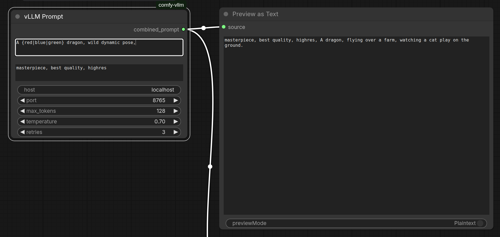

# vLLM Prompt Node for ComfyUI

A ComfyUI custom node that generates Stable Diffusion prompts using a locally
running vLLM server. Supports wildcard expansion and a fixed prefix for quality
tags or style anchors.




https://www.theoath.studio/projects/comfy-vllm-node

## Requirements

- A running vLLM server (see [vLLM docs](https://docs.vllm.ai))
- Python package: `requests` (`pip install requests`)
- ComfyUI

## Installation

1. Clone or copy this folder into your `ComfyUI/custom_nodes/` directory:
```bash
cd ComfyUI/custom_nodes
git clone https://github.com/yourname/vllm_prompt_node
```

2. Install dependencies:
```bash
pip install requests
```

3. Restart ComfyUI.

## Setup

Start your vLLM server before running ComfyUI. The node will automatically
detect whichever model is currently loaded — no need to specify it in the node.

Example launch:
```bash
vllm serve ./models/Qwen2.5-3B \
    --host 0.0.0.0 \
    --port 8765 \
    --served-model-name Qwen2.5-3B
```

> **Note:** The node queries `/v1/models` on each generation and uses the first
> model returned. If you change models, just restart your vLLM server —
> the node picks it up automatically.

## Node Inputs

| Input | Type | Default | Description |
|---|---|---|---|
| `prompt` | STRING | — | Generation instruction. Supports `{wild\|card}` syntax. |
| `prefix` | STRING | `masterpiece, best quality, highres` | Fixed tags prepended to the output. **Not sent to the model.** |
| `host` | STRING | `localhost` | vLLM server host. |
| `port` | INT | `8765` | vLLM server port. |
| `max_tokens` | INT | `128` | Maximum tokens to generate. |
| `temperature` | FLOAT | `0.7` | Sampling temperature. Higher = more creative. |
| `retries` | INT | `3` | How many times to retry on empty or failed responses. |

## Node Output

| Output | Type | Description |
|---|---|---|
| `combined_prompt` | STRING | `prefix` + generated text, ready to wire into `CLIPTextEncode` |

The node displays a live preview on the node face after each generation showing
the prefix, the raw generated text, and the final combined string separately so
you can see exactly what was assembled.

## Wildcard Syntax

Use `{option1|option2|option3}` anywhere in your prompt. One option is chosen
at random each run. Multiple wildcards are each resolved independently.
```
A {red|blue|green} dragon, {breathing fire into the sky|coiled around a mountain peak in a storm|diving into a glowing ocean abyss|rearing up against a blood moon}
```

Wildcards are expanded **before** the prompt is sent to the model, so the model
always receives a fully resolved string.

## Example Workflow
```
VLLMPromptNode ──→ CLIPTextEncode (positive) ──→ KSampler
                                                      ↑
                         CLIPTextEncode (negative) ───┘
```

## Prompt Format

The node uses the completions endpoint with a structured format that instructs
the model to return comma-separated tags only, with no conversational filler:
```
### Stable Diffusion prompt tags (comma separated, no sentences):
Input: <your expanded prompt>
Output:
```

Generation stops at the first newline, so the model cannot ramble past a single
line of tags. If you still get conversational responses, try:

- Lowering temperature to `0.3–0.5`
- Increasing to a larger model (1.5B or 3B recommended minimum)
- Reducing `max_tokens` to leave less room for filler

## Model Recommendations

| Model | Quality | Notes |
|---|---|---|
| Qwen2.5-0.5B | ⚠️ Unreliable | Too small for consistent instruction following |
| Qwen2.5-1.5B | ✓ Usable | Occasional filler, mostly clean |
| Qwen2.5-3B | ✓✓ Recommended | Clean output, follows format reliably |
| Qwen2.5-32B | ✓✓✓ Best | Overkill for this task but flawless |

## Tested With

- vLLM 0.4+
- Qwen2.5-0.5B, Qwen2.5-1.5B, Qwen2.5-3B
- ComfyUI (latest)

